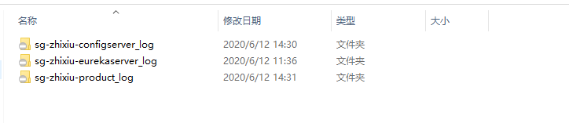

# <center>介绍</center>

## 一、项目解构

采用父子解构，父pom统一管理依赖版本。
具体如下：

- sg-zhixiu-eurekaserver 注册中心
- sg-zhixiu-configserver 配置中心
- sg-zhixiu-product 产品模块
- sg-zhixiu-order 订单模块
...

## 二、部署介绍

如果需要注册中心，则需要先启动sg-zhixiu-eurekaserver
如果需要配置中心，则需要再启动sg-zhixiu-configserver
如果不需要注册中心，则其他依赖于配置中心的项目，则需要直接跟配置中心交互，
如果都跟注册中心交互，则只需要配置注册中心的地址和配置中心的实例id即可

## 三、日志

经修改后的日志统一存放，在resources下的logback.xml中配置日志信息，存放在上层目录下的logs
文件夹下的"项目_log"文件夹中。

```xml
value="../logs/${project.artifactId}_log/log"
```


